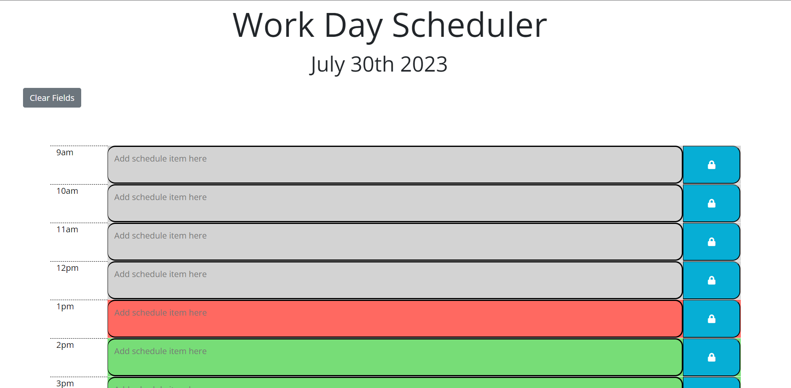

# workday-scheduler

## Description

This website was designed for users to be able to schedule their daily tasks from 9am to 5pm. Each hour block is color coded which indicates, whether it's past, present or future.  

## Installation

N/A

## Usage
Once user visits the app they are presented to blocks which represents each hour of a standard working day from 9am to 5pm. User can type their plans/tasks in each block and click save. Once page is refreshed the tasks will be still displayed. Each block is color-coded which means, pasted tasks are represented in gray, current ones in red and upcoming in green. 

When  users day is done, they can press clear and all data will be erased from the blocks. 

Deployed site/Website URL: 

## Credits

Used module 5 activities as a reference. 

## License

Please refer to the LICENSE in the repo.
